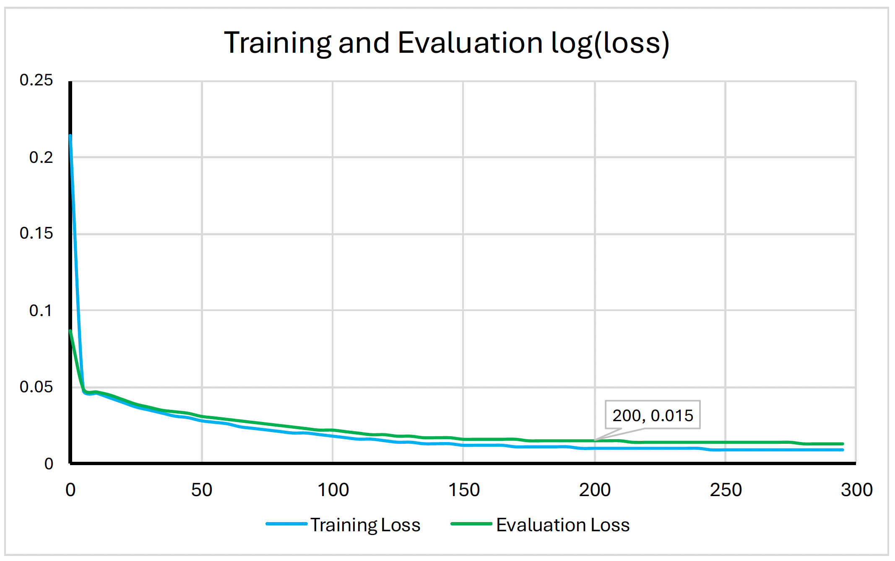
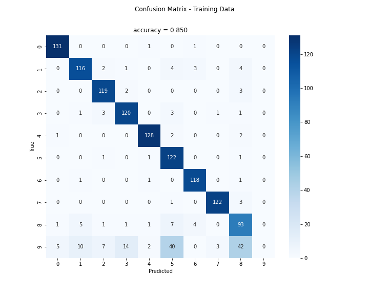
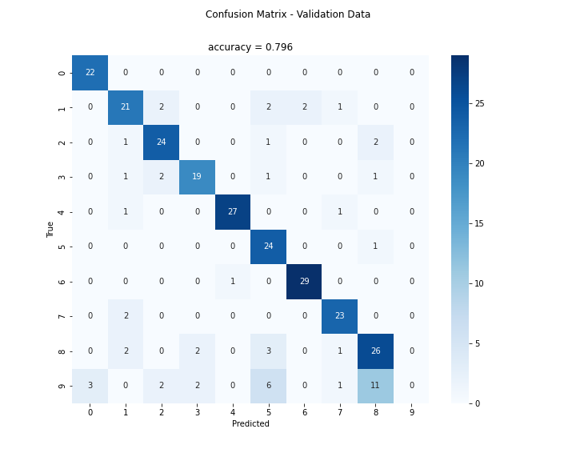
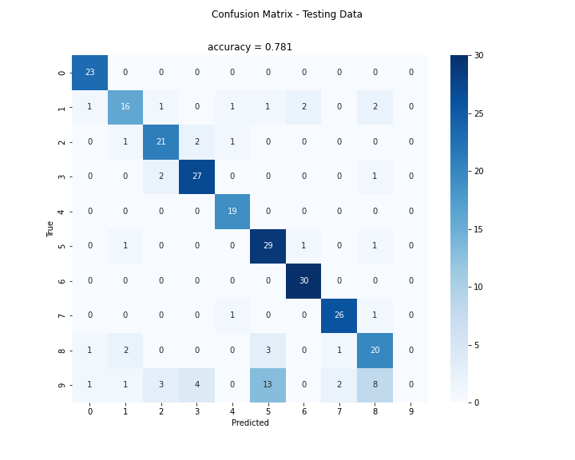
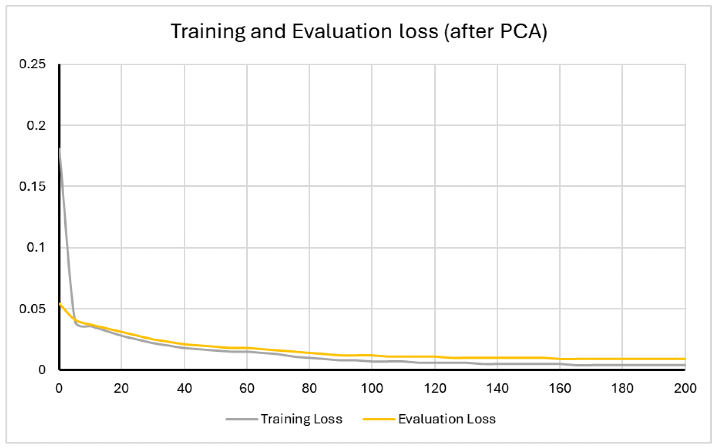
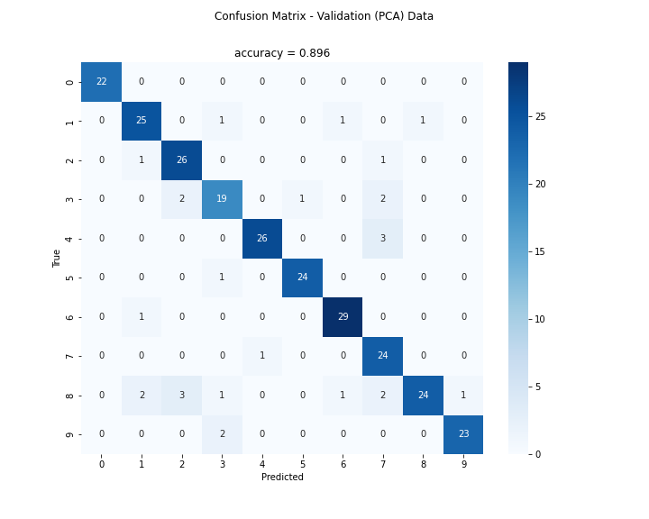
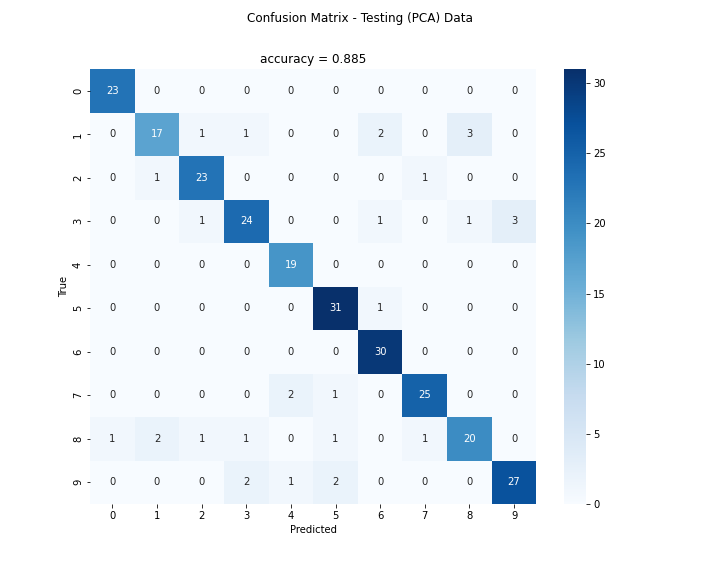

# Handwritten Digits Recognition with Neural Networks

## Overview
This project implements a neural network from scratch to recognize handwritten digits (0-9). Utilizing a dataset comprising 1,797 instances from 43 writers, the model processes normalized 32x32 bitmap images of handwritten digits to achieve high classification accuracy.

<p align="center">
      
    <br>
    <em>Figure 1: Handwritten digits and neural network architecture.</em>
</p>


## Features
- **Data Preprocessing:** Loads and preprocesses the dataset, splitting it into training, testing, and validation sets. Supports dimensionality reduction using Principal Component Analysis (PCA).
- **Neural Network Implementation:** A custom neural network with forward and backward propagation mechanisms.
- **Training Pipeline:** Manages the training process, including parameter updates and performance tracking.
- **Evaluation Metrics:** Generates confusion matrices and calculates accuracy for training, validation, and testing datasets.
- **Dimensionality Reduction:** Enhances computational efficiency by reducing feature dimensionality without significantly compromising performance.

## Project Structure
```plaintext
project/
│
├── src/

│   ├── __init__.py
│   ├── data_preprocessing.py
│   ├── neural_network.py
│   ├── train.py
│   ├── evaluate.py
│   └── main.py
├── data/
│   └── optdigits-orig.windep
├── plots/
│   ├── ...
├── requirements.txt
└── README.md
```

## Getting Started

### Prerequisites
- Python 3.6 or higher

### Installation
1. **Clone the Repository**
    ```bash
    git clone https://github.com/josephmars/digit_recognition_nn.git
    cd digit_recognition_nn
    ```


2. **Install Dependencies**
    Ensure all required Python libraries are installed:
    ```bash
    pip install -r requirements.txt
    ```

3. **Download the Dataset**
    - Download the dataset from the [UCI Machine Learning Repository](https://archive.ics.uci.edu/ml/machine-learning-databases/optdigits/optdigits-orig.windep.Z).
    - Extract the `optdigits-orig.windep` file and place it inside the `data/` directory.

### Running the Project
Execute the main script to start the data preprocessing, training, and evaluation process:
```bash
python src/main.py
```

## Results

### Data Split
The dataset was split into training, validation, and testing sets using the proportions of 70%, 15%, and 15% respectively. A fixed random seed was set to ensure reproducibility. Additionally, one-hot encoding was applied to represent the multilabel `y` into a set of 10 binary values.

| Split      | Size | Proportion |
|------------|------|------------|
| Training   | 1257 | 70%        |
| Validation | 270  | 15%        |
| Testing    | 270  | 15%        |

*Table 1: Details of the datasets.*

### Model Training and Evaluation

The neural network was trained for 300 epochs. The training and evaluation loss curves are depicted in **Figure 1**.

<p align="center">
      
    <br>
    <em>Figure 2: Training and Evaluation Loss.</em>
</p>


Based on the loss curves, it was observed that at epoch 200, the evaluation loss stabilized at 0.015 for the fifth consecutive time. Consequently, the model from this iteration was selected for further evaluation. Note that there was no implementation for saving intermediate models; thus, the final model was run again for only 200 epochs to achieve consistent results due to the fixed random seed.

**Confusion Matrices:**

- **Training Data:**
  
  <p align="center">
      
    <br>
    <em>Figure 3: Training Confusion Matrix.</em>
</p>
  

- **Validation Data:**

  <p align="center">
      
    <br>
    <em>Figure 4: Validation Confusion Matrix.</em>
</p>
  

- **Testing Data:**
  
  <p align="center">
      
    <br>
    <em>Figure 5: Testing Confusion Matrix.</em>
</p>

**Figure 2:** Confusion matrices for training, validation, and testing datasets.

*Observations:*

- **Training Accuracy:** 85.0%
- **Validation Accuracy:** 79.6%
- **Testing Accuracy:** 78.1%

The model exhibits signs of overfitting, as indicated by the higher training accuracy (85%) compared to the testing (78.1%) and validation (79.6%) accuracies. This discrepancy may be attributed to the data splitting methodology and the representativeness of the validation and testing subsets relative to the original dataset.

### Dimensionality Reduction with PCA

To enhance computational efficiency and potentially improve model performance, Principal Component Analysis (PCA) was employed to reduce the number of features from 1024 to 100. PCA effectively captures the most significant variance in the dataset, eliminating redundant features while retaining essential information.

The neural network was retrained using the PCA-transformed data for 200 epochs, analogous to the original training process. The training and evaluation loss curves after PCA are illustrated in **Figure 3**.

<p align="center">
      
    <br>
    <em>Figure 6: Training and Evaluation Loss after PCA.</em>
</p>


**Figure 3:** Training and Evaluation Loss after Dimensionality Reduction with PCA.

**Confusion Matrices:**
- **Training Data (PCA):**

  <p align="center">
      
    <br>
    <em>Figure 7: Training Confusion Matrix (PCA).</em>
</p>
  

- **Validation Data (PCA):**

  <p align="center">
      
    <br>
    <em>Figure 8: Validation Confusion Matrix (PCA).</em>
</p>
  

- **Testing Data (PCA):**

  <p align="center">
      
    <br>
    <em>Figure 9: Testing Confusion Matrix (PCA).</em>
</p>


**Figure 4:** Confusion matrices for training, validation, and testing datasets after PCA.

*Observations:*
- **Training Accuracy:** 96.9%
- **Validation Accuracy:** 79.6% 
- **Testing Accuracy:** 88.5%

The application of PCA led to a significant improvement in the model's testing accuracy, increasing it from 78.1% to 88.5%. However, the training accuracy surged to 96.9%, suggesting an intensified degree of overfitting. This indicates that while PCA aids in computational efficiency and enhances generalization on unseen data, it may also amplify overfitting tendencies if not balanced with regularization techniques.